# 🚗💡 Automotive Lighting Remote Testing Platform  
### Final Year Internship Project – Primatec

---

## 📌 Project Overview

This project was developed during my final-year internship at **Primatec**.

I developed a web-based testing platform that allows testers to execute tests on a **physical automotive mock-up** simulating a car’s exterior lighting system (parking, driving, braking, etc.).

The platform supports **three types of testing**:

- **Manual Testing**  
  Testers execute tests manually by interacting with the mock-up’s buttons.

- **Automation Testing**  
  Testers write test cases using **Robot Framework**, which are sent to the mock-up for automatic execution; results are returned directly to the platform.

- **Jenkins Pipeline Execution**  
  - Testers select a test case from the application  
  - A Jenkins pipeline is automatically triggered  
  - Communicates with the mock-up via SSH  
  - Executes the test and returns results to Jenkins, displayed in the application

After the test, the tester can download the log and report files.
If the test fails, it might be because of a hardware problem, a bug, or simply a mistake. if it is a bug  The tester should inform the developer to fix the issue.
To make communication easier between testers and developers, I integrated Api Jira into the application so testers can create bug tickets directly from the app.
Finally, I deployed the application on a server so testers can access it using a simple URL, without installing anything. 

---

## 🛠️ Technologies Used

###  Front-End
-  Angular  
-  TypeScript  
-  Bootstrap  

###  Back-End
-  Spring Boot  
-  REST APIs  
- FastAPI (test execution communication) 

###  Database
-  MySQL  

###  DevOps
-  Docker & Docker Compose  
-  CI/CD Automation
- Jenkins  

## 👥 Team & Methodology

- Developed in a team using **Agile Scrum**  
- **Jira** for task tracking  
- **Git** for version control  
---

## 🔌 Hardware Communication

The platform communicates with a **real automotive lighting hardware mock-up**.  
Test cases trigger physical signals on the mock-up, executed and logged in real time, creating a realistic industrial testing environment.

---

## 🎬 Demo

Watch the application demo here:

[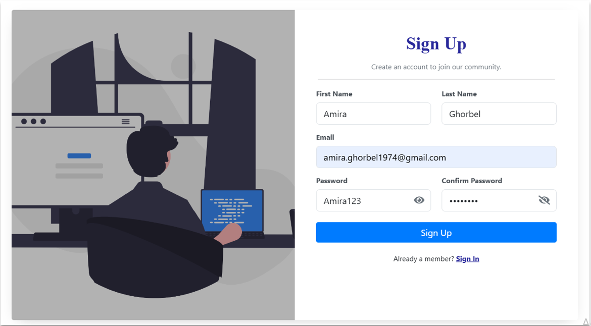](https://vimeo.com/1165653912)

---

## 📸 Screenshots

### 🔹 SignUp  

### 🔹 SignIn  
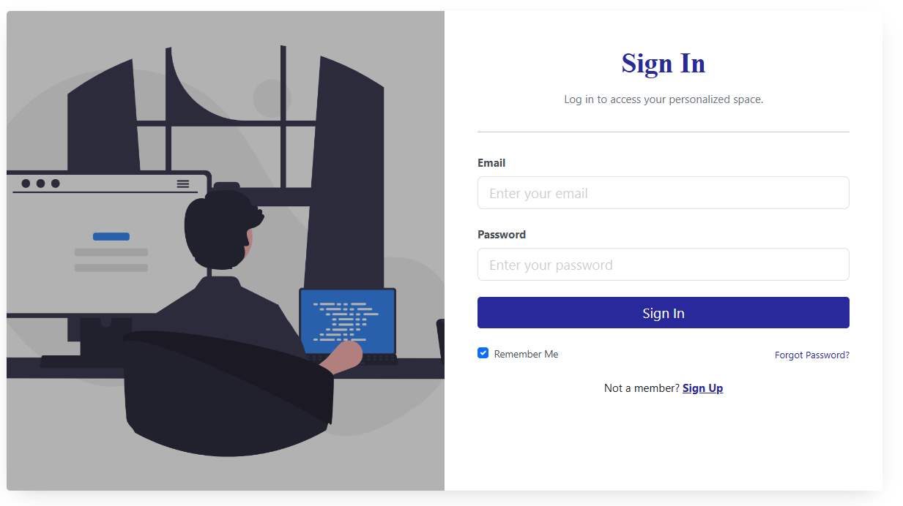

### 🔹 Home Page  
(User selects the type of mock-up: Light mock-up for car lights, Window mock-up for windows, etc.)  
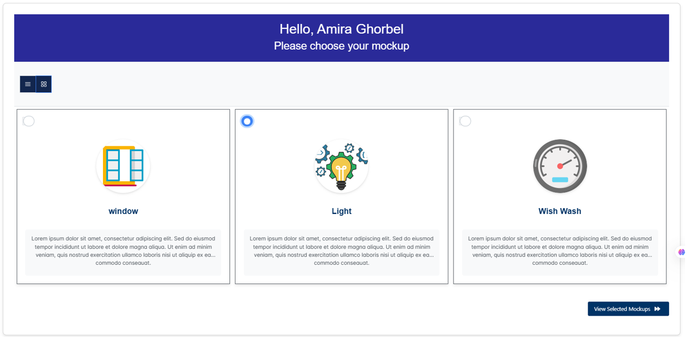

### 🔹 User Management  
(Admin can delete, edit, accept/reject users, change roles, and invite to Jira)  
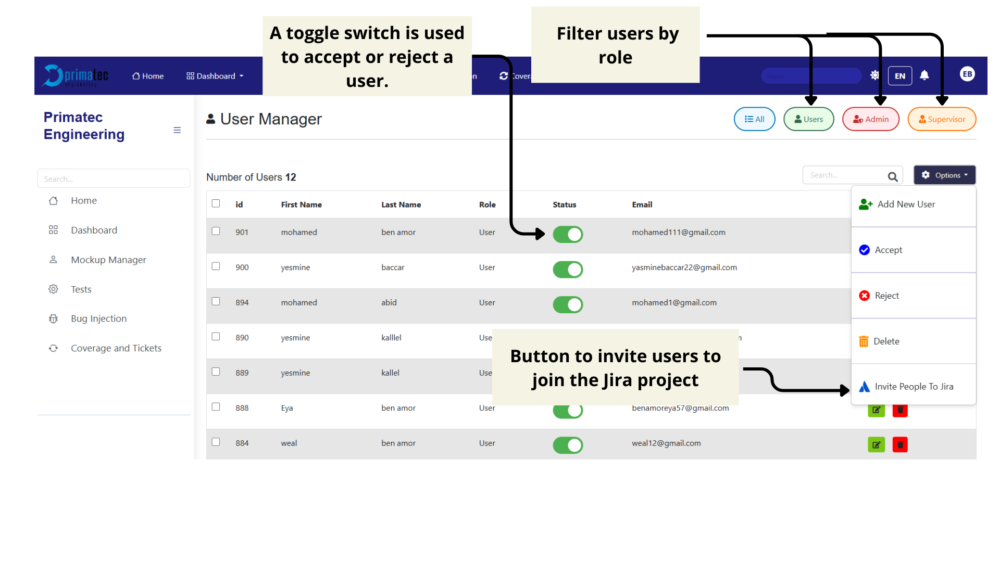

### 🔹 File Management  
(Admin can upload Excel files with users; system automatically imports them)  
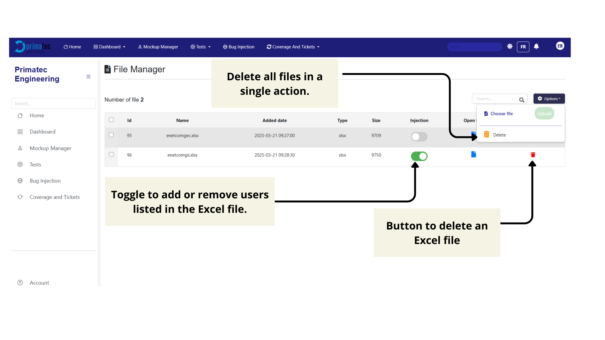

### 🔹 Automation Testing Interface (Git)  
(Test cases synchronized with Git repository)  
  
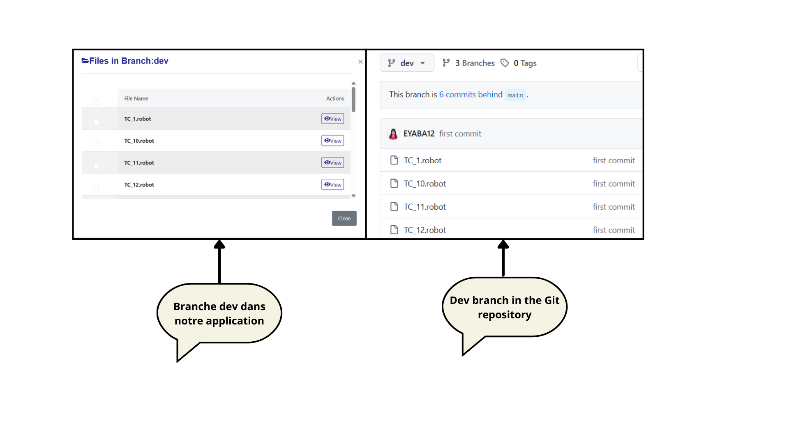

### 🔹 Automation Testing Interface (Local)  
(Testers can import test cases from their local machine)  

### 🔹 Testing with Jenkins Interface  
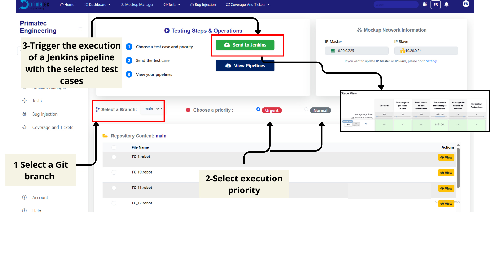

### 🔹 Jenkins Pipeline  
(Jenkins executes test case via SSH, returns results, and sends email notifications)  
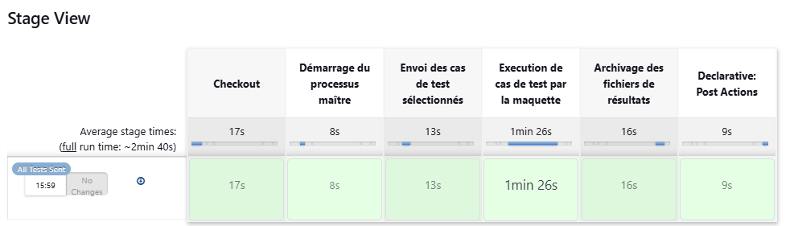

### 🔹 Email Notification  
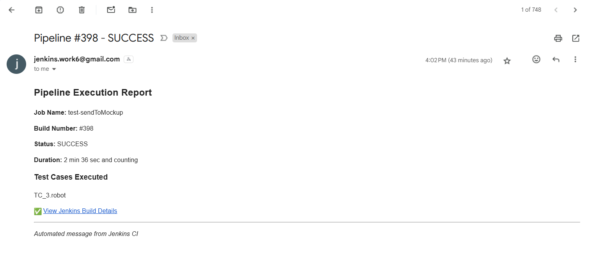

### 🔹 Jenkins Results in Application  
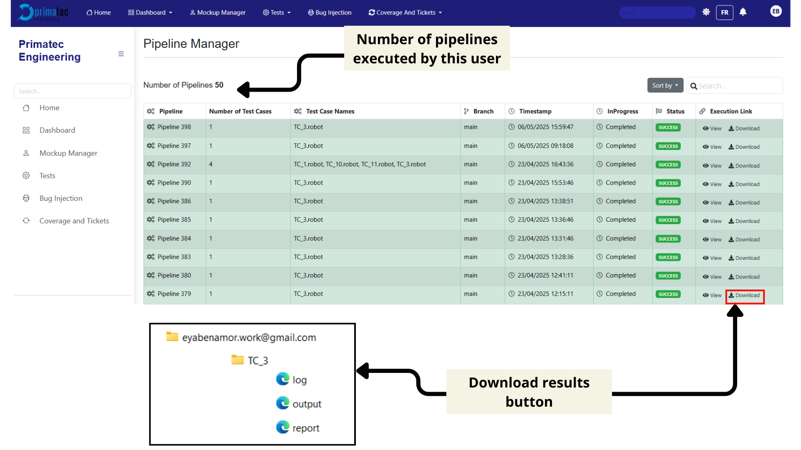

### 🔹 Downloaded Results  
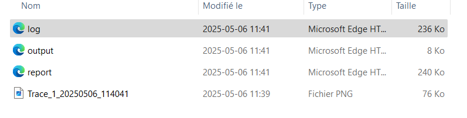

### 🔹 Jira Ticket Interface  
(Synchronized with Jira for bug tracking)  
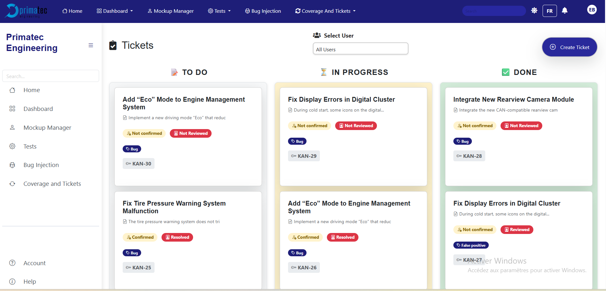  
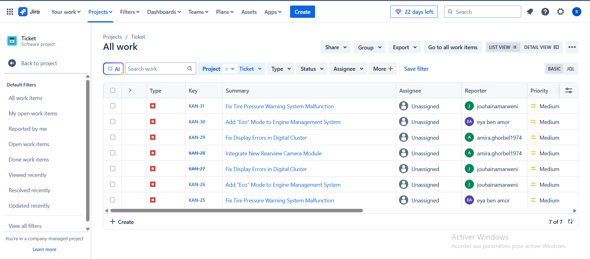

---

## 🏆 Achievement

🏅 Selected as **Best Final Year Project – ENET’Com Promotion 2025**  
🎓 Presented at the **University Fair 2025 (univExpo2025)**  

### 📸 University Fair Presentation  
  
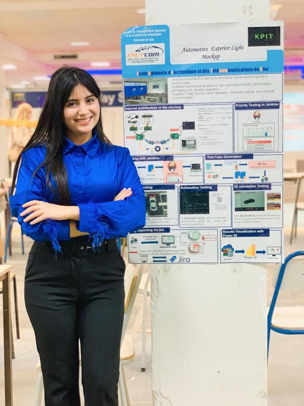
